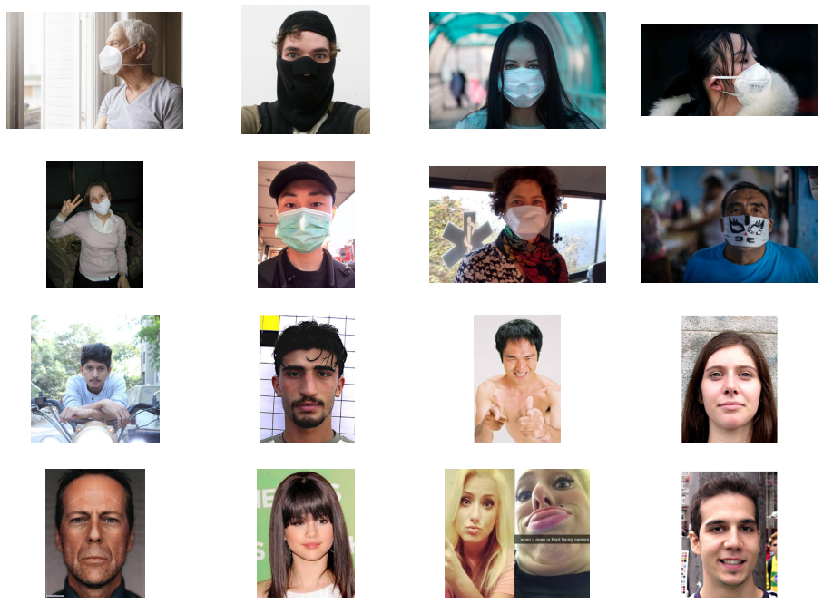

# face-mask-detection

### My Plot

```
import os

base_dir = "face_mask/dataset"

os.listdir(base_dir)
```

['Test', 'Train', 'Validation']

```
train_dir = os.path.join(base_dir, "Train")

train_dir
```

'face_mask/dataset\\Train'

```
valid_dir = os.path.join(base_dir, "Validation")

valid_dir
```

'face_mask/dataset\\Validation'

```
test_dir = os.path.join(base_dir, "Test")

test_dir
```

'face_mask/dataset\\Test'

```
os.listdir(train_dir)
```

['Mask', 'Non Mask']

```
train_dir_mask = os.path.join(train_dir, "Mask")

train_dir_mask
```

'face_mask/dataset\\Train\\Mask'

```
train_dir_mask_names = os.listdir(train_dir_mask)

train_dir_mask_names[:5]
```

['0003.jpg', '0006.jpg', '0018.jpg', '0019.jpg', '0022.jpg']

```
train_dir_nomask = os.path.join(train_dir, "Non Mask")

train_dir_nomask
```

'face_mask/dataset\\Train\\Non Mask'

```
train_dir_nomask_names = os.listdir(train_dir_nomask)

train_dir_nomask_names[:5]
```

['0.jpg', '1.jpg', '10.jpg', '100.jpg', '101.jpg']



### My Process

```
from tensorflow.keras.preprocessing import image as I

test_img_path = "face_mask_test/nomask_4.jpg"

img = I.load_img(test_img_path, target_size=(150, 150))
print("1. Original image type: {}, shape: {}".format(type(img), img.size))

arr_img = I.img_to_array(img)
print("2. Preprocess image to array, type: {}, shape: {}".format(type(arr_img), arr_img.shape))

dim_added_img = np.expand_dims(arr_img, axis=0)
print("3. Using numpy to add image dimension to BHWC, type: {}, shape: {}".format(type(dim_added_img), dim_added_img.shape))
```

Output
1. Original image type: <class 'PIL.Image.Image'>, shape: (150, 150)
2. Preprocess image to array, type: <class 'numpy.ndarray'>, shape: (150, 150, 3)
3. Using numpy to add image dimension to BHWC, type: <class 'numpy.ndarray'>, shape: (1, 150, 150, 3)

Note:

PIL.Image.Image ---> img.size

numpy.ndarray ---> img.shape

### My Inference

```
from openvino.runtime import Core

core = Core()
model = core.read_model('C:/Users/Jonathan/saved_model.xml')

compiled_model = core.compile_model(model, 'CPU')
results = compiled_model.infer_new_request({0: images})

print(results)
print(type(results))
print(results.values())

inference = list(results.values())[0]
print(inference)
```

{<ConstOutput: names[Func/StatefulPartitionedCall/output/_11:0, Identity:0, StatefulPartitionedCall/Identity:0, StatefulPartitionedCall/sequential/dense_2/Sigmoid:0] shape{1,1} type: f32>: array([[0.]], dtype=float32)}

<class 'dict'>

dict_values([array([[0.]], dtype=float32)])

[[0.]]

### My Logs

```
model = tf.keras.models.Sequential([
        tf.keras.layers.Conv2D(32, (3, 3), padding='SAME', activation='relu', input_shape=(150, 150, 3)),
        tf.keras.layers.MaxPooling2D(pool_size=(2, 2)),
        tf.keras.layers.Dropout(0.5),
    
        tf.keras.layers.Conv2D(64, (3, 3), padding='SAME', activation='relu'),
        tf.keras.layers.MaxPooling2D(pool_size=(2, 2)),
        tf.keras.layers.Dropout(0.5),
        
        tf.keras.layers.Conv2D(128, (3, 3), padding='SAME', activation='relu'),
        tf.keras.layers.MaxPooling2D(pool_size=(2, 2)),
        tf.keras.layers.Dropout(0.5),
    
        tf.keras.layers.Flatten(),
    
        tf.keras.layers.Dense(256, activation='relu'),
        tf.keras.layers.Dropout(0.5),
        tf.keras.layers.Dense(1, activation='sigmoid')
])

model.summary()

Model: "sequential_1"
_________________________________________________________________
Layer (type)                 Output Shape              Param #   
=================================================================
conv2d_5 (Conv2D)            (None, 150, 150, 16)      448       
_________________________________________________________________
max_pooling2d_5 (MaxPooling2 (None, 75, 75, 16)        0         
_________________________________________________________________
dropout_6 (Dropout)          (None, 75, 75, 16)        0         
_________________________________________________________________
conv2d_6 (Conv2D)            (None, 75, 75, 32)        4640      
_________________________________________________________________
max_pooling2d_6 (MaxPooling2 (None, 37, 37, 32)        0         
_________________________________________________________________
dropout_7 (Dropout)          (None, 37, 37, 32)        0         
_________________________________________________________________
conv2d_7 (Conv2D)            (None, 37, 37, 64)        18496     
_________________________________________________________________
max_pooling2d_7 (MaxPooling2 (None, 18, 18, 64)        0         
_________________________________________________________________
dropout_8 (Dropout)          (None, 18, 18, 64)        0         
_________________________________________________________________
conv2d_8 (Conv2D)            (None, 18, 18, 128)       73856     
_________________________________________________________________
max_pooling2d_8 (MaxPooling2 (None, 9, 9, 128)         0         
_________________________________________________________________
dropout_9 (Dropout)          (None, 9, 9, 128)         0         
_________________________________________________________________
conv2d_9 (Conv2D)            (None, 9, 9, 256)         295168    
_________________________________________________________________
max_pooling2d_9 (MaxPooling2 (None, 4, 4, 256)         0         
_________________________________________________________________
dropout_10 (Dropout)         (None, 4, 4, 256)         0         
_________________________________________________________________
flatten_1 (Flatten)          (None, 4096)              0         
_________________________________________________________________
dense_2 (Dense)              (None, 512)               2097664   
_________________________________________________________________
dropout_11 (Dropout)         (None, 512)               0         
_________________________________________________________________
dense_3 (Dense)              (None, 1)                 513       
=================================================================
Total params: 2,490,785
Trainable params: 2,490,785
Non-trainable params: 0
```

```
type(history)
```

tensorflow.python.keras.callbacks.History

```
type(history.history)
```

dict

```
history.history.keys()
```

dict_keys(['loss', 'accuracy', 'val_loss', 'val_accuracy'])

```
history.history['accuracy'][:10]
```

[0.5,
 0.5,
 0.5333333611488342,
 0.5516666769981384,
 0.57833331823349,
 0.7016666531562805,
 0.7599999904632568,
 0.8583333492279053,
 0.8933333158493042,
 0.8866666555404663]

```
import matplotlib.pyplot as plt

#help(plt.plot)

plt.plot(history.history['accuracy'])
plt.plot(history.history['val_accuracy'])
plt.xlabel('epochs')
plt.ylabel('accuracy')
plt.title('train and validation accuracy')
plt.legend(['train', 'valid'])

plt.show()
```

```
from tensorflow.keras.preprocessing import image as I
import numpy as np

img = I.load_img("face_mask_test/mask_2.jpg", target_size=(150, 150))
print(type(img), img.size)

plt.imshow(img)

img = I.img_to_array(img)
print(type(img), img.shape)

img = np.expand_dims(img, axis=0)
print(type(img), img.shape)
```

<class 'PIL.Image.Image'> (150, 150)<br>
<class 'numpy.ndarray'> (150, 150, 3)<br>
<class 'numpy.ndarray'> (1, 150, 150, 3)
