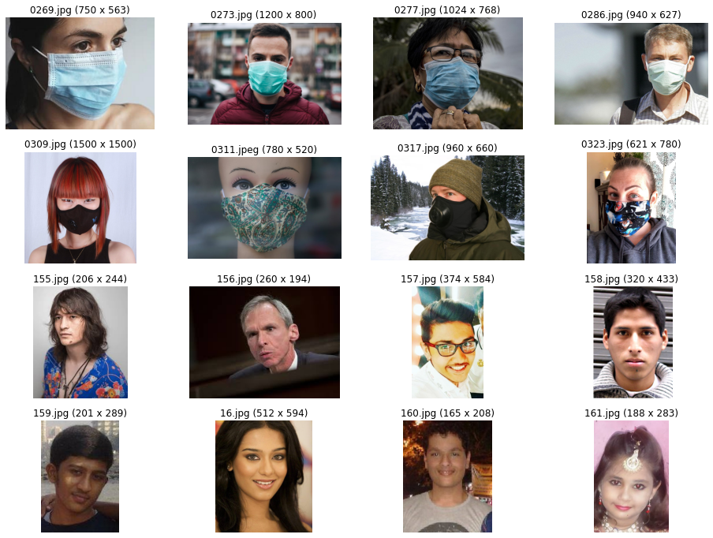

# face-mask-detection

### My Plot

```
import os

base_dir = "face_mask/dataset"

os.listdir(base_dir)
```

['Test', 'Train', 'Validation']

```
train_dir = os.path.join(base_dir, "Train")

train_dir
```

'face_mask/dataset\\Train'

```
valid_dir = os.path.join(base_dir, "Validation")

valid_dir
```

'face_mask/dataset\\Validation'

```
test_dir = os.path.join(base_dir, "Test")

test_dir
```

'face_mask/dataset\\Test'

```
os.listdir(train_dir)
```

['Mask', 'Non Mask']

```
train_dir_mask = os.path.join(train_dir, "Mask")

train_dir_mask
```

'face_mask/dataset\\Train\\Mask'

```
train_dir_mask_names = os.listdir(train_dir_mask)

train_dir_mask_names[:5]
```

['0003.jpg', '0006.jpg', '0018.jpg', '0019.jpg', '0022.jpg']

```
train_dir_nomask = os.path.join(train_dir, "Non Mask")

train_dir_nomask
```

'face_mask/dataset\\Train\\Non Mask'

```
train_dir_nomask_names = os.listdir(train_dir_nomask)

train_dir_nomask_names[:5]
```

['0.jpg', '1.jpg', '10.jpg', '100.jpg', '101.jpg']

```
# I want to make a base...
# It can be fulled with 4x4 images...
# I should set number of nows and columns...

nrows = 4
ncols = 4

img_index = 0
```

```
fig = plt.gcf()
fig.set_size_inches(nrows*4, ncols*3)

print("Current image index...{}".format(img_index))

img_index += 8

train_mask_imgs = [os.path.join(train_dir_mask, fname) for fname in train_dir_mask_imgs[img_index-8: img_index]]
train_nomask_imgs = [os.path.join(train_dir_nomask, fname) for fname in train_dir_nomask_imgs[img_index-8: img_index]]
my_imgs_list = train_mask_imgs + train_nomask_imgs

for i, img_path in enumerate(my_imgs_list):
    ax = plt.subplot(nrows, ncols, i+1)
    ax.axis('Off')
    
    img = mpimg.imread(img_path)
    plt.imshow(img)
```

Current image index...24


```
import matplotlib.pyplot as plt
import matplotlib.image as mpimg


img_index = 0
counter = 0

nrows = 4
ncols = 4
```

```
fig = plt.figure(figsize=(nrows*4, ncols*3))

counter += 1

print("There are {} mask images and {} non mask images in the training directory.".format
      (len(train_dir_mask_imgs), len(train_dir_nomask_imgs)))
print("This is the {} round execution".format(counter))
print("Current image plot index starts from: {} / {}".format(img_index, len(train_dir_mask_imgs)))

img_index += 8


train_mask_imgs = ([os.path.join(train_dir_mask, fname)
                    for fname in train_dir_mask_imgs])[img_index-8: img_index]

train_nomask_imgs = ([os.path.join(train_dir_nomask, fname)
                      for fname in train_dir_nomask_imgs])[img_index-8: img_index]

my_imgs = train_mask_imgs + train_nomask_imgs

for i, img_path in enumerate(my_imgs):
    
    ax = plt.subplot(nrows, ncols, i+1)
    ax.axis('Off')
    
    img = mpimg.imread(img_path)
    h = img.shape[0]
    w = img.shape[1]

    ax.set_title(img_path.split("\\")[-1] + " ({} x {})".format(w, h))
    plt.imshow(img)
```

There are 300 mask images and 300 non mask images in the training directory.<br>
This is the 8 round execution<br>
Current image plot index starts from: 56 / 300



```
import tensorflow as tf
from tensorflow.keras.preprocessing.image import load_img, img_to_array
from tensorflow.keras.preprocessing.image import ImageDataGenerator

import numpy as np
import matplotlib.pyplot as plt

img_path = "face_mask/dataset/Train/Mask/0003.jpg"
datagen = ImageDataGenerator(rotation_range=40)

img = load_img(img_path, target_size=(150, 150))
img_tensor = img_to_array(img)
dim_added_img = np.expand_dims(img_tensor, axis=0)

pic = datagen.flow(dim_added_img)
plt.figure(figsize=(10, 8))

for i in range(3):
    ax = plt.subplot(1, 3, i+1)
    ax.axis('Off')
    batch = pic.next()
    image = batch[0].astype('uint8')
    plt.imshow(image)
    
plt.show()
```


### My Process

```
from tensorflow.keras.preprocessing import image as I

test_img_path = "face_mask_test/nomask_4.jpg"

img = I.load_img(test_img_path, target_size=(150, 150))
print("1. Original image type: {}, shape: {}".format(type(img), img.size))

arr_img = I.img_to_array(img)
print("2. Preprocess image to array, type: {}, shape: {}".format(type(arr_img), arr_img.shape))

dim_added_img = np.expand_dims(arr_img, axis=0)
print("3. Using numpy to add image dimension to BHWC, type: {}, shape: {}".format(type(dim_added_img), dim_added_img.shape))
```

Output
1. Original image type: <class 'PIL.Image.Image'>, shape: (150, 150)
2. Preprocess image to array, type: <class 'numpy.ndarray'>, shape: (150, 150, 3)
3. Using numpy to add image dimension to BHWC, type: <class 'numpy.ndarray'>, shape: (1, 150, 150, 3)

Note:

PIL.Image.Image ---> img.size

numpy.ndarray ---> img.shape

### My Inference

```
from openvino.runtime import Core

core = Core()
model = core.read_model('C:/Users/Jonathan/saved_model.xml')

compiled_model = core.compile_model(model, 'CPU')
results = compiled_model.infer_new_request({0: images})

print(results)
print(type(results))
print(results.values())

inference = list(results.values())[0]
print(inference)
```

{<ConstOutput: names[Func/StatefulPartitionedCall/output/_11:0, Identity:0, StatefulPartitionedCall/Identity:0, StatefulPartitionedCall/sequential/dense_2/Sigmoid:0] shape{1,1} type: f32>: array([[0.]], dtype=float32)}

<class 'dict'>

dict_values([array([[0.]], dtype=float32)])

[[0.]]

### My Logs

```
model = tf.keras.models.Sequential([
        tf.keras.layers.Conv2D(32, (3, 3), padding='SAME', activation='relu', input_shape=(150, 150, 3)),
        tf.keras.layers.MaxPooling2D(pool_size=(2, 2)),
        tf.keras.layers.Dropout(0.5),
    
        tf.keras.layers.Conv2D(64, (3, 3), padding='SAME', activation='relu'),
        tf.keras.layers.MaxPooling2D(pool_size=(2, 2)),
        tf.keras.layers.Dropout(0.5),
        
        tf.keras.layers.Conv2D(128, (3, 3), padding='SAME', activation='relu'),
        tf.keras.layers.MaxPooling2D(pool_size=(2, 2)),
        tf.keras.layers.Dropout(0.5),
    
        tf.keras.layers.Flatten(),
    
        tf.keras.layers.Dense(256, activation='relu'),
        tf.keras.layers.Dropout(0.5),
        tf.keras.layers.Dense(1, activation='sigmoid')
])

model.summary()

Model: "sequential_1"
_________________________________________________________________
Layer (type)                 Output Shape              Param #   
=================================================================
conv2d_5 (Conv2D)            (None, 150, 150, 16)      448       
_________________________________________________________________
max_pooling2d_5 (MaxPooling2 (None, 75, 75, 16)        0         
_________________________________________________________________
dropout_6 (Dropout)          (None, 75, 75, 16)        0         
_________________________________________________________________
conv2d_6 (Conv2D)            (None, 75, 75, 32)        4640      
_________________________________________________________________
max_pooling2d_6 (MaxPooling2 (None, 37, 37, 32)        0         
_________________________________________________________________
dropout_7 (Dropout)          (None, 37, 37, 32)        0         
_________________________________________________________________
conv2d_7 (Conv2D)            (None, 37, 37, 64)        18496     
_________________________________________________________________
max_pooling2d_7 (MaxPooling2 (None, 18, 18, 64)        0         
_________________________________________________________________
dropout_8 (Dropout)          (None, 18, 18, 64)        0         
_________________________________________________________________
conv2d_8 (Conv2D)            (None, 18, 18, 128)       73856     
_________________________________________________________________
max_pooling2d_8 (MaxPooling2 (None, 9, 9, 128)         0         
_________________________________________________________________
dropout_9 (Dropout)          (None, 9, 9, 128)         0         
_________________________________________________________________
conv2d_9 (Conv2D)            (None, 9, 9, 256)         295168    
_________________________________________________________________
max_pooling2d_9 (MaxPooling2 (None, 4, 4, 256)         0         
_________________________________________________________________
dropout_10 (Dropout)         (None, 4, 4, 256)         0         
_________________________________________________________________
flatten_1 (Flatten)          (None, 4096)              0         
_________________________________________________________________
dense_2 (Dense)              (None, 512)               2097664   
_________________________________________________________________
dropout_11 (Dropout)         (None, 512)               0         
_________________________________________________________________
dense_3 (Dense)              (None, 1)                 513       
=================================================================
Total params: 2,490,785
Trainable params: 2,490,785
Non-trainable params: 0
```

```
type(history)
```

tensorflow.python.keras.callbacks.History

```
type(history.history)
```

dict

```
history.history.keys()
```

dict_keys(['loss', 'accuracy', 'val_loss', 'val_accuracy'])

```
history.history['accuracy'][:10]
```

[0.5,
 0.5,
 0.5333333611488342,
 0.5516666769981384,
 0.57833331823349,
 0.7016666531562805,
 0.7599999904632568,
 0.8583333492279053,
 0.8933333158493042,
 0.8866666555404663]

```
import matplotlib.pyplot as plt

#help(plt.plot)

plt.plot(history.history['accuracy'])
plt.plot(history.history['val_accuracy'])
plt.xlabel('epochs')
plt.ylabel('accuracy')
plt.title('train and validation accuracy')
plt.legend(['train', 'valid'])

plt.show()
```

```
from tensorflow.keras.preprocessing import image as I
import numpy as np

img = I.load_img("face_mask_test/mask_2.jpg", target_size=(150, 150))
print(type(img), img.size)

plt.imshow(img)

img = I.img_to_array(img)
print(type(img), img.shape)

img = np.expand_dims(img, axis=0)
print(type(img), img.shape)
```

<class 'PIL.Image.Image'> (150, 150)<br>
<class 'numpy.ndarray'> (150, 150, 3)<br>
<class 'numpy.ndarray'> (1, 150, 150, 3)

### My Model

```
from tensorflow.keras.layers import Dropout

class Block(tf.keras.models.Model):
    
    def __init__(self, filters, kernel_size, repetitions, pool_size = 2, strides = 2):
        
        super(Block, self).__init__()
        
        self.filters = filters
        self.kernel_size = kernel_size
        self.repetitions = repetitions
        
        for i in range(0, self.repetitions):
            vars(self)[f'conv2D_{i}'] = tf.keras.layers.Conv2D(self.filters, self.kernel_size, padding = 'same', activation = 'relu')
        
        self.max_pool = tf.keras.layers.MaxPool2D(pool_size = pool_size, strides = strides)
        
    def call(self, inputs):
        
        conv2D_0 = inputs
        x = conv2D_0
        
        for i in range(1, self.repetitions):
            conv2D_agg = vars(self)[f'conv2D_{i}']
            x = conv2D_agg(x)
            
        x = self.max_pool(x)
        
        return x
        
class MyVGG(tf.keras.models.Model):
    
    def __init__(self, num_classes):
        
        super(MyVGG, self).__init__()
        
        self.block_a = Block(64, 3, 2)
        self.block_b = Block(128, 3, 2)
        self.block_c = Block(256, 3, 3)
        self.block_d = Block(512, 3, 3)
        self.block_e = Block(512, 3, 3)
        
        self.dropout = Dropout(0.1)
        
        self.flatten = tf.keras.layers.Flatten()
        self.fc = tf.keras.layers.Dense(256, activation = 'relu')
        self.classifier = tf.keras.layers.Dense(num_classes, activation = 'sigmoid')
        
    def call(self, inputs):
        
        x = inputs
        
        x = self.block_a(x)
        #x = self.dropout(x)
        
        x = self.block_b(x)
        #x = self.dropout(x)
        
        x = self.block_c(x)
        #x = self.dropout(x)
        
        x = self.block_d(x)
        #x = self.dropout(x)
        
        x = self.block_e(x)
        #x = self.dropout(x)
        
        x = self.flatten(x)
        x = self.fc(x)
        #x = self.dropout(x)
        x = self.classifier(x)
        
        return x
        
model = MyVGG(1)

from tensorflow.keras.optimizers import Adam

model.compile(optimizer=Adam(lr=0.001), loss='binary_crossentropy', metrics=['accuracy'])

history = model.fit(train_generator, epochs=30, validation_data=valid_generator)
```

```
Epoch 1/30
19/19 [==============================] - 34s 2s/step - loss: 0.6921 - accuracy: 0.5183 - val_loss: 0.6844 - val_accuracy: 0.5392
Epoch 2/30
19/19 [==============================] - 35s 2s/step - loss: 0.6696 - accuracy: 0.5533 - val_loss: 0.6756 - val_accuracy: 0.5294
Epoch 3/30
19/19 [==============================] - 36s 2s/step - loss: 0.6508 - accuracy: 0.6233 - val_loss: 0.6581 - val_accuracy: 0.6699
Epoch 4/30
19/19 [==============================] - 36s 2s/step - loss: 0.6178 - accuracy: 0.7267 - val_loss: 0.6596 - val_accuracy: 0.5621
Epoch 5/30
19/19 [==============================] - 36s 2s/step - loss: 0.5872 - accuracy: 0.7400 - val_loss: 0.6262 - val_accuracy: 0.6797
Epoch 6/30
19/19 [==============================] - 36s 2s/step - loss: 0.5633 - accuracy: 0.7633 - val_loss: 0.6090 - val_accuracy: 0.6830
Epoch 7/30
19/19 [==============================] - 36s 2s/step - loss: 0.5360 - accuracy: 0.7550 - val_loss: 0.6012 - val_accuracy: 0.6634
Epoch 8/30
19/19 [==============================] - 36s 2s/step - loss: 0.5076 - accuracy: 0.7700 - val_loss: 0.5727 - val_accuracy: 0.7026
Epoch 9/30
19/19 [==============================] - 37s 2s/step - loss: 0.4884 - accuracy: 0.8000 - val_loss: 0.5562 - val_accuracy: 0.7157
Epoch 10/30
19/19 [==============================] - 36s 2s/step - loss: 0.4666 - accuracy: 0.8150 - val_loss: 0.5548 - val_accuracy: 0.7157
Epoch 11/30
19/19 [==============================] - 37s 2s/step - loss: 0.4439 - accuracy: 0.8283 - val_loss: 0.5155 - val_accuracy: 0.7451
Epoch 12/30
19/19 [==============================] - 36s 2s/step - loss: 0.4396 - accuracy: 0.8067 - val_loss: 0.4982 - val_accuracy: 0.7549
Epoch 13/30
19/19 [==============================] - 36s 2s/step - loss: 0.4195 - accuracy: 0.8383 - val_loss: 0.5349 - val_accuracy: 0.7026
Epoch 14/30
19/19 [==============================] - 37s 2s/step - loss: 0.4245 - accuracy: 0.8150 - val_loss: 0.4648 - val_accuracy: 0.7614
Epoch 15/30
19/19 [==============================] - 37s 2s/step - loss: 0.3797 - accuracy: 0.8583 - val_loss: 0.4525 - val_accuracy: 0.7810
Epoch 16/30
19/19 [==============================] - 37s 2s/step - loss: 0.3711 - accuracy: 0.8683 - val_loss: 0.4449 - val_accuracy: 0.7810
Epoch 17/30
19/19 [==============================] - 36s 2s/step - loss: 0.3671 - accuracy: 0.8733 - val_loss: 0.4865 - val_accuracy: 0.7353
Epoch 18/30
19/19 [==============================] - 36s 2s/step - loss: 0.3682 - accuracy: 0.8467 - val_loss: 0.4188 - val_accuracy: 0.7974
Epoch 19/30
19/19 [==============================] - 36s 2s/step - loss: 0.3580 - accuracy: 0.8667 - val_loss: 0.4094 - val_accuracy: 0.8072
Epoch 20/30
19/19 [==============================] - 36s 2s/step - loss: 0.3466 - accuracy: 0.8650 - val_loss: 0.3970 - val_accuracy: 0.8170
Epoch 21/30
19/19 [==============================] - 36s 2s/step - loss: 0.3598 - accuracy: 0.8700 - val_loss: 0.3911 - val_accuracy: 0.8235
Epoch 22/30
19/19 [==============================] - 37s 2s/step - loss: 0.3288 - accuracy: 0.8700 - val_loss: 0.3836 - val_accuracy: 0.8203
Epoch 23/30
19/19 [==============================] - 37s 2s/step - loss: 0.3285 - accuracy: 0.8700 - val_loss: 0.3786 - val_accuracy: 0.8235
Epoch 24/30
19/19 [==============================] - 36s 2s/step - loss: 0.3295 - accuracy: 0.8700 - val_loss: 0.3715 - val_accuracy: 0.8301
Epoch 25/30
19/19 [==============================] - 36s 2s/step - loss: 0.3145 - accuracy: 0.8767 - val_loss: 0.3632 - val_accuracy: 0.8399
Epoch 26/30
19/19 [==============================] - 36s 2s/step - loss: 0.3048 - accuracy: 0.8933 - val_loss: 0.3764 - val_accuracy: 0.8529
Epoch 27/30
19/19 [==============================] - 37s 2s/step - loss: 0.3009 - accuracy: 0.8917 - val_loss: 0.3671 - val_accuracy: 0.8627
Epoch 28/30
19/19 [==============================] - 36s 2s/step - loss: 0.2991 - accuracy: 0.8867 - val_loss: 0.3570 - val_accuracy: 0.8464
Epoch 29/30
19/19 [==============================] - 36s 2s/step - loss: 0.2985 - accuracy: 0.8700 - val_loss: 0.3905 - val_accuracy: 0.8039
Epoch 30/30
19/19 [==============================] - 37s 2s/step - loss: 0.3131 - accuracy: 0.8867 - val_loss: 0.3500 - val_accuracy: 0.8562
```

### My Reference

The VGG Network has blocks of layers, where each block has a varied number of layers.
- In order to create blocks of layers that have a customizable number of conv2D layers, you'll define a class `Block`, which can generate a customizable block of layers 


#### `__init__`
In the constructor `__init__`, store the conv2D parameters and also define the number of conv2D layers using the parameters passed into `__init__`.
- Store the filters, kernel_size, and repetitions as class variables so that they can be used later in the `call` function.
- Using a for loop, define a number of Conv2D [Conv2D](https://keras.io/api/layers/convolution_layers/convolution2d/) layers, based on the number of `repetitions` desired for this block.
    - You can define each conv2D layer using `vars` and string formatting to create conv2D_0, conv2D_1, conv2D_3 etc.
    - Set these four parameters of Conv2D:
        - filters
        - kernel_size
        - activation: set this to 'relu'
        - padding: set this to 'same' (default pading is 'valid').
        
- Define the [MaxPool2D](https://keras.io/api/layers/pooling_layers/max_pooling2d/) layer that follows these Conv2D layers. 
    - Set the following parameters for MaxPool2D:
        - pool_size: this will be a tuple with two values.
        - strides: this will also be a tuple with two values.

#### `call`
In `call`, you will connect the layers together.
- The 0-th conv2D layer, `conv2D_0`, immediately follows the `inputs`.
- For conv2D layers 1,2 and onward, you can use a for loop to connect conv2D_1 to conv2D_0, and connect conv2D_2 to conv2D_1, and so on.
- After connecting all of the conv2D_i layers, add connect the max_pool layer and return the max_pool layer.

```

class Block(tf.keras.models.Model):
    
    def __init__(self, filters, kernel_size, repetitions, pool_size=2, strides=2):
        super(Block, self).__init__()
        self.filters = filters
        self.kernel_size = kernel_size
        self.repetitions = repetitions
        
        for i in range(0, self.repetitions):
            vars(self)[f'conv2D_{i}'] = tf.keras.layers.Conv2D(filters=self.filters,
                                                               kernel_size=self.kernel_size,
                                                               padding='same',
                                                               activation='relu')
        
        self.max_pool = tf.keras.layers.MaxPool2D(pool_size=pool_size, strides=strides)
        
    def call(self, inputs):
        
        x = inputs
        
        for i in range(1, self.repetitions):
            conv2D_agg = vars(self)[f'conv2D_{i}']
            x = conv2D_agg(x)
            
        x = self.max_pool(x)
        
        return x
 ```
